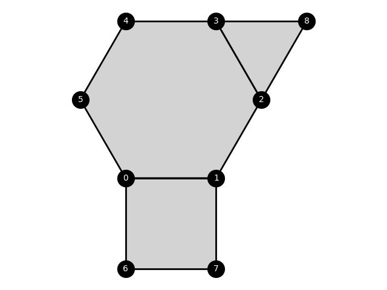
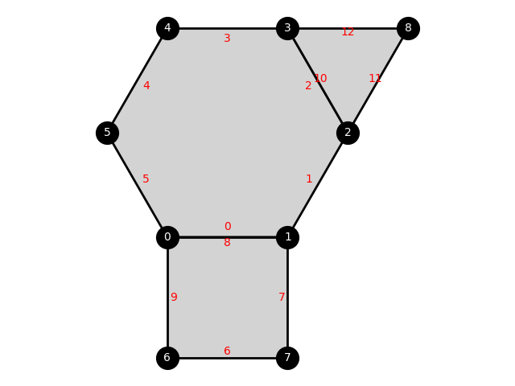
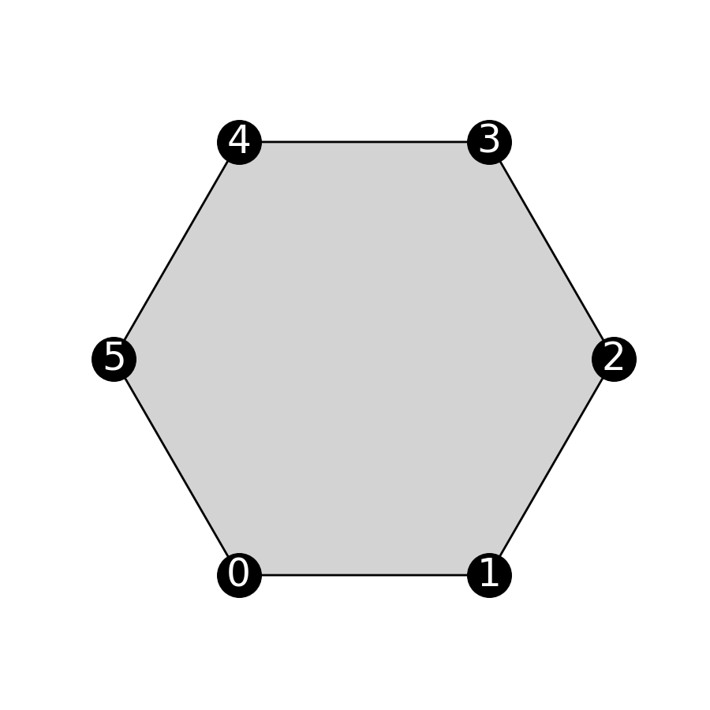

# MeshRL

[](https://github.com/ArjunNarayanan/Polygraph/actions/workflows/python-app.yml)
[](https://codecov.io/gh/ArjunNarayanan/Polygraph)

This package provides a framework to train reinforcement learning agents to generate 2D polygonal meshes from input
geometries.

## Mesh Data Structure

`src.tiler.Tiler` implements a class to represent general 2D polygonal meshes. We leverage the half-edge data-structure
to represent arbitrary mixed meshes with different polygonal elements. Meshes are initialized by providing face-loops
that represent a given geometry. The loops are expected to be in counter-clockwise order.

```python
import numpy as np
from src.tiler import Tiler
from src.render import Renderer


def vertex_coordinates():
    c = np.cos(np.pi / 3)
    s = np.sin(np.pi / 3)
    coords = [[-c, -s],
              [c, -s],
              [1, 0],
              [c, s],
              [-c, s],
              [-1, 0]]
    # vertex coordinates are expected to be provided as a dictionary mapping vertex labels 
    # to their coordinate values
    coords = dict(zip(range(6), coords))
    return coords


coords = vertex_coordinates()
mesh = Tiler.from_face_loops(
    [[0, 1, 2, 3, 4, 5]],
    vertex_coordinates=coords
)
renderer = Renderer(
    mesh,
    coords=mesh.vertex_coordinates,
    label_vertices=True,
)
renderer.plot()
```


Similarly, we can generate mixed meshes with different elements,

```python
coords[6] = coords[0] - np.array([0, 1])
coords[7] = coords[1] - np.array([0, 1])
coords[8] = np.array([1.5, np.sin(np.pi / 3)])
mesh = Tiler.from_face_loops(
    [
        [0, 1, 2, 3, 4, 5],
        [6, 7, 1, 0],
        [3, 2, 8]
    ],
    vertex_coordinates=coords,
)
renderer = Renderer(
    mesh,
    coords=mesh.vertex_coordinates,
    label_vertices=True,
)
renderer.plot()
```



`src.tiler.Tiler` exposes useful operations based on the half-edge data-structure. To see the half-edges, use the
keyword `label_halfedge=True` in the Renderer.

```python
renderer = Renderer(
    mesh,
    coords=mesh.vertex_coordinates,
    label_vertices=True,
    label_halfedge=True
)
renderer.plot()
```



The half-edges are labeled in red font. The numbering should be viewed as labels as there is no inherent ordering of
half-edges. In fact, any hashable type can be used as a label for halfedges, vertices, and faces. Halfedges are
maintained in counterclockwise order. You can query the data-structure for next, previous, and
twin half-edges.

```python
print(mesh.next_half_edge(0, tag=False))  # prints 1
print(mesh.previous_half_edge(0, tag=False))  # prints 5
print(mesh.twin_half_edge(0, tag=False))  # prints 8
```

Vertices and faces associated with a half-edge can be accessed as follows,

```python
print(mesh.face(5, tag=False))  # prints 0
print(mesh.face(10, tag=False))  # prints 2
```

Notice that half-edge 5 is part of the first face-loop at mesh initialization -- hence its face is given index 0.
Similarly half-edge 10 is part of the third face-loop and thus has index 2.

You can query the degree of vertices and faces in the datastructure,

```python
print(mesh.vertex_degree(0))  # degree of vertex 0 == 3
print(mesh.face_degree(mesh.face(9)))  # degree of face associated with half-edge 9 == 4
```

## Mesh Edit Operations

The half-edge datastructure provides an efficient way to perform local topological edit operations. `src.tiler.Tiler`
supports the following edit operations:

- Edge insertion -- creates a new face by inserting an edge between two vertices in a given face
- Edge deletion -- delete a specified edge and merge adjacent faces
- Vertex insertion -- insert a vertex at the mid-point of an edge. New vertex will always have degree 2.
- Vertex deletion -- delete a vertex by merging adjacent edges. Only degree 2 vertices can be deleted.

### Edge insertion

`src.tiler.Tiler.insert_half_edge(hidx, k)` inserts a new edge between source of `hidx` and target of the halfedge that
is `k` `next` operations ahead. Consider the hexagonal example,



```python
mesh.insert_half_edge(0, 1)
```


