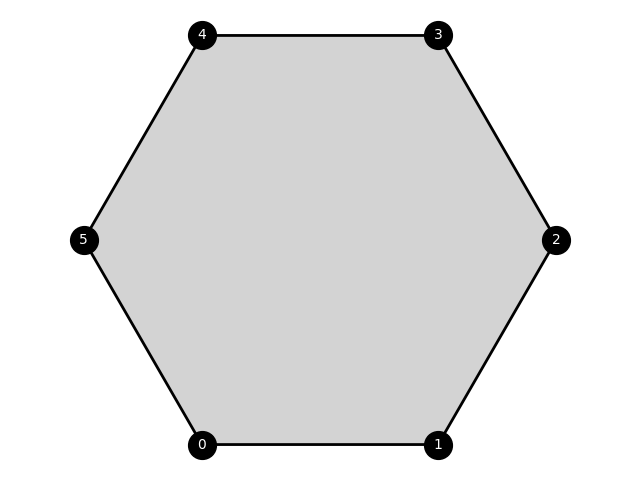

# MeshRL

[](https://github.com/ArjunNarayanan/Polygraph/actions/workflows/python-app.yml)
[](https://codecov.io/gh/ArjunNarayanan/Polygraph)

This package provides a framework to train reinforcement learning agents to generate 2D polygonal meshes from input
geometries.

## Mesh Data Structure

`src.tiler.Tiler` implements a class to represent general 2D polygonal meshes. We leverage the half-edge data-structure
to represent arbitrary mixed meshes with different polygonal elements. Meshes are initialized by providing face-loops
that represent a given geometry. The loops are expected to be in counter-clockwise order.

```python
import numpy as np
from src.tiler import Tiler
from src.render import Renderer


def vertex_coordinates():
    c = np.cos(np.pi / 3)
    s = np.sin(np.pi / 3)
    coords = [[-c, -s],
              [c, -s],
              [1, 0],
              [c, s],
              [-c, s],
              [-1, 0]]
    # vertex coordinates are expected to be provided as a dictionary mapping vertex labels 
    # to their coordinate values
    coords = dict(zip(range(6), coords))
    return coords


coords = vertex_coordinates()
mesh = Tiler.from_face_loops(
    [[0, 1, 2, 3, 4, 5]],
    vertex_coordinates=coords
)
renderer = Renderer(
    mesh,
    coords=mesh.vertex_coordinates,
    label_vertices=True,
)
renderer.plot()
```



Similarly, we can generate mixed meshes with different elements,

```python
coords[6] = coords[0] - np.array([0, 1])
coords[7] = coords[1] - np.array([0, 1])
coords[8] = np.array([1.5, np.sin(np.pi/3)])
mesh = Tiler.from_face_loops(
    [
        [0, 1, 2, 3, 4, 5],
        [6, 7, 1, 0],
        [3, 2, 8]
    ],
    vertex_coordinates=coords,
)
renderer = Renderer(
    mesh,
    coords=mesh.vertex_coordinates,
    label_vertices=True,
)
renderer.plot()
```

